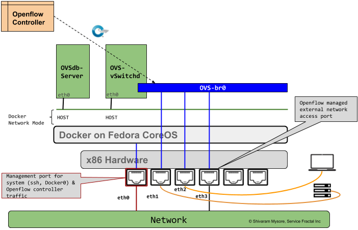

:Authors:
    Shivaram Mysore

Running `Open vSwitch (OVS) <http://www.openvswitch.org/>`_ on Containers
=========================================================================

House Keeping
#############

  *  Sources: https://github.com/servicefractal/ovs 
  *  Docker Images: https://hub.docker.com/r/shivarammysore/ovs or :code:`docker pull servicefractal/ovs`
  *  Issues, feature requests, suggestions, - https://github.com/servicefractal/ovs/issues 
  *  Twitter: `@servicefractal <https://twitter.com/servicefractal>`_ 
  *  Pull Requests, bug fixes, etc welcome

Introduction
############

Traditionally, we have OVS running as a part of Operating System (Unbutu, Fedora) installed primarily as a package.  This project is an effort to run OVS inside of a container.  We use `Docker <https://docker.com>`_ as a the default container platform and `Fedora CoreOS <https://getfedora.org/coreos/>`_ as as the underlying OS.

Quick Start
########### 

Assumptions
^^^^^^^^^^^

    *  Fedora CoreOS with user ``core`` and ``$HOME`` directory under ``/home/core``
    *  Fedora CoreOS is installed on x86 bare metal with 4 ethernet ports (``eth0`` - ``eth3``)
    *  ``eth0`` is used as management port.  Rest of the ports are used as ports on OVS bridge
    *  `Faucet <https://faucet.nz>`_ Openflow based Controller is used to test Openflow mode on OVS.
    *  :code:`openvswitch, vport_geneve, vport_gre, vport_vxlan, tap` Kernel modules are autoloaded on boot

A `SVG version <docs/images/OVSonContainers.svg>`_ of the image

Steps
^^^^^

.. code-block:: shell
   :linenos:

  $ cd $HOME 
  $ sudo install -d --owner=root --group=root --mode=0755 \
    /home/core/ovs/log \
    /home/core/ovs/var/lib/openvswitch/pki \
    /home/core/ovs/var/run/openvswitch \
    /home/core/ovs/etc/openvswitch
  $ docker pull servicefractal/ovs:latest
  $ docker run \
    --name=ovsdb-server \
    --cap-add=NET_ADMIN \
    --cap-add=SYS_MODULE \
    --cap-add=SYS_NICE \
    --network=host \
    --volume=/lib/modules:/lib/modules \
    --volume=/home/core/ovs/log:/var/log/openvswitch \
    --volume=/home/core/ovs/var/lib/openvswitch:/var/lib/openvswitch \
    --volume=/home/core/ovs/var/run/openvswitch:/var/run/openvswitch \
    --volume=/home/core/ovs/etc/openvswitch:/etc/openvswitch \
    --security-opt label=disable \
    --privileged \
    servicefractal/ovs:latest ovsdb-server
  $ docker run \
    --name=ovs-vswitchd \
    --cap-add=NET_ADMIN \
    --cap-add=SYS_MODULE \
    --cap-add=SYS_NICE \
    --network=host \
    --volumes-from=ovsdb-server \
    --security-opt label:disable \
    --privileged \
    servicefractal/ovs:latest ovs-vswitchd
  $ docker exec -it ovs-vswitchd ovs-vsctl show
  $ docker exec -it ovs-vswitchd ovs-vsctl --may-exist add-br ovs-br0 \
    -- set bridge ovs-br0 protocols=OpenFlow13 \
    other_config:datapath-id=0x08090A0B0C0D0E0F \
    other_config:dp-desc=baremetal-ovs
  $ docker exec -it ovs-vswitchd ovs-vsctl set-fail-mode ovs-br0 secure
  $ docker exec -it ovs-vswitchd ovs-vsctl get bridge ovs-br0 datapath_id
  $ docker exec -it ovs-vswitchd ovs-vsctl add-port ovs-br0 eth1 -- set Interface eth1 ofport_request=1 type=system
  $ docker exec -it ovs-vswitchd ovs-vsctl add-port ovs-br0 eth2 -- set Interface eth2 ofport_request=2 type=system
  $ docker exec -it ovs-vswitchd ovs-vsctl add-port ovs-br0 eth3 -- set Interface eth3 ofport_request=3 type=system
  $ docker exec -it ovs-vswitchd ovs-vsctl set-controller ovs-br0 tcp:openflow_controller.example.org:6653
  $ docker exec -it ovs-vswitchd ovs-vsctl show

The above set of commands will install the pre-built docker image for OVS, start it, create bridge, add system ports and finally configure the controller.

Troubleshooting
^^^^^^^^^^^^^^^

Below are some useful commands to help with debugging.  This is not an exahaustive list, but just a quick reference.

.. code-block:: console

  $ docker logs <container_name>
  $ sudo tail -f /home/core/ovs/log/ovs-vswitchd.log 
  $ ip a --> if ports are connected to OVS bridge, they will have ovs-system for the corresponding port
  $ sudo ls -C1 /lib/modules/$(uname -r)/kernel/net/openvswitch  --> check OVS Kernel modules 
  $ sudo modinfo openvswitch  --> Get Open vSwitch Kernel Module info 
  $ sudo /sbin/modprobe openvswitch  --> Load kernel module openvswitch
  $ sudo /sbin/lsmod | grep openvswitch  --> check if openvswitch kernel module is loaded

Docker Networking Refresher Tutorial
====================================

Docker Host Networking
----------------------

The host driver
---------------

  *  Container is started with :code:`docker run --net host ...`
  *  It sees (and can access) the network interfaces of the host.
  *  It can bind any address, any port (for ill and for good).
  *  Network traffic doesn't have to go through ``NAT``, ``bridge``, or ``veth``.
  *  Performance = native!
  *  Reference: https://container.training/intro-selfpaced.yml.html#329

MACVLAN Docker network
----------------------

When using macvlan, you cannot ``ping`` or communicate with the default namespace IP address. For example, if you create a container and try to ping the Docker host’s ``eth0``, it will not work. That traffic is explicitly filtered by the kernel modules themselves to offer additional provider isolation and security.

A macvlan subinterface can be added to the Docker host, to allow traffic between the Docker host and containers. The IP address needs to be set on this subinterface and removed from the parent address.

The container driver
--------------------

  *  Container is started with :code:`docker run --net container:id ...`
  *  It re-uses the network stack of another container.
  *  It shares with this other container the same interfaces, IP address(es), routes, iptables rules, etc.
  *  Those containers can communicate over their lo interface.  (i.e. one can bind to ``127.0.0.1`` and the others can connect to it.)
  *  Reference: https://container.training/intro-selfpaced.yml.html#330

Custom networks
---------------

When creating a network, extra options can be provided.
  *  :code:`--internal` disables outbound traffic (the network won't have a default gateway).
  *  :code:`--gateway` indicates which address to use for the gateway (when outbound traffic is allowed).
  *  :code:`--subnet` (in CIDR notation) indicates the subnet to use.
  *  :code:`--ip-range` (in CIDR notation) indicates the subnet to allocate from.
  *  :code:`--aux-address` allows specifying a list of reserved addresses (which won't be allocated to containers).
  *  Reference: https://container.training/intro-selfpaced.yml.html#362

Connecting and Disconnecting from networks dynamically
------------------------------------------------------

  *  The Docker Engine also allows connecting and disconnecting while the container is running.
  *  This feature is exposed through the Docker API, and through two Docker CLI commands:
        *  :code:`docker network connect <network> <container>`
        *  :code:`docker network disconnect <network> <container>`
  *  Reference: https://container.training/intro-selfpaced.yml.html#367 

Docker Capabilities
-------------------

With OVS being run as a container, it needs some privileges to access network and system resources.  In Docker, this is controlled by providing `"Capability"<https://docs.docker.com/engine/reference/run/#runtime-privilege-and-linux-capabilities>`_ permissions to the running container.  For OVS to work, Capabilities such as ``"SYS_MODULE"``, ``"NET_ADMIN"`` and ``"SYS_NICE"`` are required.

.. code-block:: text
   :linenos:

    Capability Key       Capability Description
    ===========================================
    SYS_MODULE       Load and unload kernel modules.
    SYS_RAWIO        Perform I/O port operations (iopl(2) and ioperm(2)).
    SYS_PACCT        Use acct(2), switch process accounting on or off.
    SYS_ADMIN        Perform a range of system administration operations.
    SYS_NICE         Raise process nice value (nice(2), setpriority(2)) and change the nice value for arbitrary processes.
    SYS_RESOURCE     Override resource Limits.
    SYS_TIME         Set system clock (settimeofday(2), stime(2), adjtimex(2)); set real-time (hardware) clock.
    SYS_TTY_CONFIG   Use vhangup(2); employ various privileged ioctl(2) operations on virtual terminals.
    AUDIT_CONTROL    Enable and disable kernel auditing; change auditing filter rules; retrieve auditing status and filtering rules.
    MAC_ADMIN        Allow MAC configuration or state changes. Implemented for the Smack LSM.
    MAC_OVERRIDE     Override Mandatory Access Control (MAC). Implemented for the Smack Linux Security Module (LSM).
    NET_ADMIN        Perform various network-related operations.
    SYSLOG           Perform privileged syslog(2) operations.
    DAC_READ_SEARCH  Bypass file read permission checks and directory read and execute permission checks.
    LINUX_IMMUTABLE  Set the FS_APPEND_FL and FS_IMMUTABLE_FL i-node flags.
    NET_BROADCAST    Make socket broadcasts, and listen to multicasts.
    IPC_LOCK         Lock memory (mlock(2), mlockall(2), mmap(2), shmctl(2)).
    IPC_OWNER        Bypass permission checks for operations on System V IPC objects.
    SYS_PTRACE       Trace arbitrary processes using ptrace(2).
    SYS_BOOT         Use reboot(2) and kexec_load(2), reboot and load a new kernel for later execution.
    LEASE            Establish leases on arbitrary files (see fcntl(2)).
    WAKE_ALARM       Trigger something that will wake up the system.
    BLOCK_SUSPEND    Employ features that can block system suspend.

From http://man7.org/linux/man-pages/man7/capabilities.7.html

.. code-block:: text
   :linenos:

    CAP_NET_ADMIN
            Perform various network-related operations:
            * interface configuration;
            * administration of IP firewall, masquerading, and accounting;
            * modify routing tables;
            * bind to any address for transparent proxying;
            * set type-of-service (TOS)
            * clear driver statistics;
            * set promiscuous mode;
            * enabling multicasting;
            * use setsockopt(2) to set the following socket options:
            SO_DEBUG, SO_MARK, SO_PRIORITY (for a priority outside the
            range 0 to 6), SO_RCVBUFFORCE, and SO_SNDBUFFORCE.
    CAP_NET_RAW
            * Use RAW and PACKET sockets;
            * bind to any address for transparent proxying.
    CAP_SYS_ADMIN
            Note: this capability is overloaded; see Notes to kernel
            developers, below.

            * Perform a range of system administration operations
            including: quotactl(2), mount(2), umount(2), pivot_root(2),
            setdomainname(2);
            * perform privileged syslog(2) operations (since Linux 2.6.37,
            CAP_SYSLOG should be used to permit such operations);
            * perform VM86_REQUEST_IRQ vm86(2) command;
            * perform IPC_SET and IPC_RMID operations on arbitrary System
            V IPC objects;
            * override RLIMIT_NPROC resource limit;
            * perform operations on trusted and security Extended
            Attributes (see xattr(7));
            * use lookup_dcookie(2);
            * use ioprio_set(2) to assign IOPRIO_CLASS_RT and (before
            Linux 2.6.25) IOPRIO_CLASS_IDLE I/O scheduling classes;
            * forge PID when passing socket credentials via UNIX domain
            sockets;
            * exceed /proc/sys/fs/file-max, the system-wide limit on the
            number of open files, in system calls that open files (e.g.,
            accept(2), execve(2), open(2), pipe(2));
            * employ CLONE_* flags that create new namespaces with
            clone(2) and unshare(2) (but, since Linux 3.8, creating user
            namespaces does not require any capability);
            * call perf_event_open(2);
            * access privileged perf event information;
            * call setns(2) (requires CAP_SYS_ADMIN in the target
            namespace);
            * call fanotify_init(2);
            * call bpf(2);
            * perform privileged KEYCTL_CHOWN and KEYCTL_SETPERM keyctl(2)
            operations;
            * perform madvise(2) MADV_HWPOISON operation;
            * employ the TIOCSTI ioctl(2) to insert characters into the
            input queue of a terminal other than the caller's
            controlling terminal;
            * employ the obsolete nfsservctl(2) system call;
            * employ the obsolete bdflush(2) system call;
            * perform various privileged block-device ioctl(2) operations;
            * perform various privileged filesystem ioctl(2) operations;
            * perform privileged ioctl(2) operations on the /dev/random
            device (see random(4));
            * install a seccomp(2) filter without first having to set the
            no_new_privs thread attribute;
            * modify allow/deny rules for device control groups;
            * employ the ptrace(2) PTRACE_SECCOMP_GET_FILTER operation to
            dump tracee's seccomp filters;
            * employ the ptrace(2) PTRACE_SETOPTIONS operation to suspend
            the tracee's seccomp protections (i.e., the
            PTRACE_O_SUSPEND_SECCOMP flag);
            * perform administrative operations on many device drivers.
    CAP_SYS_MODULE
            * Load and unload kernel modules (see init_module(2) and
            delete_module(2));
            * in kernels before 2.6.25: drop capabilities from the system-
            wide capability bounding set.

Namespaces Refresher Tutorial
=============================

Let's first understand what network namespaces are. So basically, when you install Linux, by default the entire OS share the same routing table and the same IP address. The namespace forms a cluster of all global system resources which can only be used by the processes within the namespace, providing resource isolation.

Docker containers use this technology to form their own cluster of resources which would be used only by that namespace, i.e. that container. Hence every container has its own IP address and work in isolation without facing resource sharing conflicts with other containers running on the same system.

Linux’s network namespaces are used to glue container processes and the host networking stack. Docker spawns a container in the containers own network namespace (use the CLONE_NEWNET flag defined in sched.h when calling the clone system call to create a new network namespace for the subprocess) and later on runs a veth pair (a cable with two ends) between the container namespace and the host network stack.

IP Tables
=========

Docker extensively uses ``iptables`` to provide isolation amongst its services and filtering of traffic. Mostly, we may never have to touch this feature unless, the underlying system has a custom ``iptables`` rules.

References
==========

    *  Docker - https://docker.com
    *  Fedora CoreOS - https://getfedora.org/coreos/
    *  Container Tutorial - https://container.training/intro-selfpaced.yml.html#1
    *  Useful ``iptable`` commands - https://www.cyberciti.biz/tips/linux-iptables-examples.html 
    *  Linux Netdev - https://arthurchiao.github.io/blog/ovs-deep-dive-4-patch-port/  - Read about why type=system, type=netdev, type=internal, etc are used with ovs-vsctl add-port command
    *  Namespaces - https://www.edureka.co/community/33605/what-network-namespace-access-network-namespace-container
    *   Docker and Network namespaces - https://platform9.com/blog/container-namespaces-deep-dive-container-networking/
